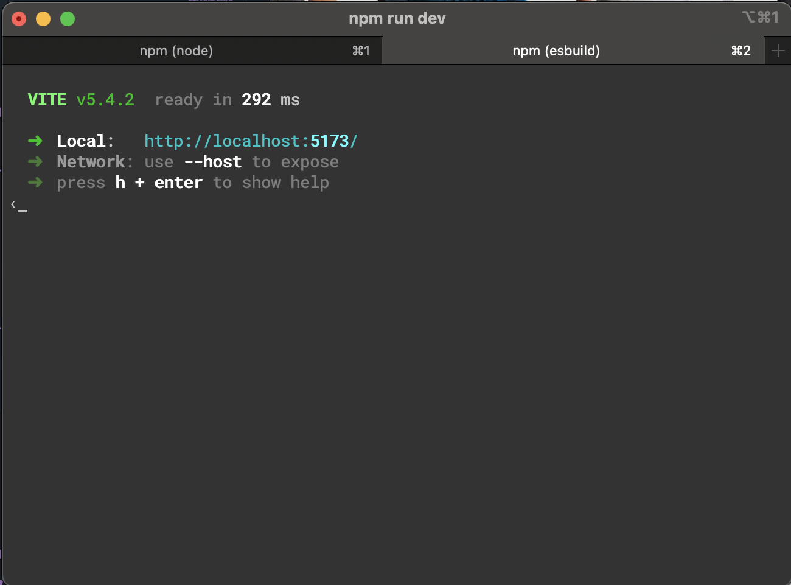

# A weather app created for Techtonica.

## Setup Instructions

1. Clone into the repository on your local machine.
2. Use ```npm install``` to install cors, dotenv, and express.
3. Open up a new terminal window. Navigate to the server directory and run ```npm run start```.
4. Open a new tab in the terminal. Navigate to the client directory and run ```npm run start```.
    
    Click on the local host that's displayed in your terminal and the app should render.
5. Enter the city name of your choice into the text field and click "take me there". If you enter a name that is not a city, as shown below, the app will give you an error.
    

## Goals

- Presentation
  - You can show that your DB / Third-Party API and endpoints work. [x]
  - You are able to demo event handling. [x]
  - You can show that your files have been deployed. [x]
- Code
  - You have comments that explain each data call, event handler, and each function. [ ]
  - You can show that you have event handling that manipulates data adequately across the frontend to the server and vice versa. [x]
  - Your state and updated state naming makes sense. [x]
  - Clean file structure with organization that makes sense according to best practice. [ ]
- README
  - Nice-to-have/secondary or stretch goals
  - Technologies used

## ToDo List

- "Bare Minimum" Project Goals
  - Put setup and instructions with visuals in the README
  - Create example .env file
  - Edit CSS files/do basic cleanup
  - Create a component that displays weather info
  - Stretch Goals/Welcome to Night Vale themed stuff
    - To be added : >

## Photo credit notes

- desert-day: Photo by <a href="https://unsplash.com/@wolfgang_hasselmann?utm_content=creditCopyText&utm_medium=referral&utm_source=unsplash">Wolfgang Hasselmann</a> on <a href="https://unsplash.com/photos/dessert-field-pVr6wvUneMk?utm_content=creditCopyText&utm_medium=referral&utm_source=unsplash">Unsplash</a>
- desert-night: Photo by <a href="https://unsplash.com/@yamaicle?utm_content=creditCopyText&utm_medium=referral&utm_source=unsplash">Mike Yukhtenko</a> on <a href="https://unsplash.com/photos/desert-at-night-a2kD4b0KK4s?utm_content=creditCopyText&utm_medium=referral&utm_source=unsplash">Unsplash</a>
